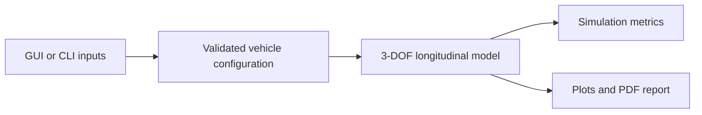

# Vehicle Dynamics Simulation

[](https://github.com/mr2buzi/Vehicle-Simulator/actions/workflows/ci.yml)

## What the product is

This project is a Python vehicle acceleration simulator focused on straight-line longitudinal dynamics. It lets a user configure a car's engine, gearing, tire grip, drag, and mass properties, then run a simulation that produces:

- a 0-60 mph estimate
- a top-speed estimate
- longitudinal acceleration and slip traces
- a PDF engineering report with charts and equations

The project is designed to be demoable in two ways:

- a Tkinter GUI for interactive exploration
- a CLI for repeatable, headless runs

This keeps the simulation core reusable for automated analysis as well as the desktop application.

## Architecture



The codebase is now split into small modules rather than one monolithic script:

```text
.
|-- sim.py
|-- requirements.txt
|-- tests/
|   |-- test_config.py
|   `-- test_model.py
`-- vehicle_sim/
    |-- __init__.py
    |-- cli.py
    |-- config.py
    |-- gui.py
    |-- model.py
    `-- report.py
```

The runtime flow is:

1. Parameters are loaded from GUI inputs or CLI overrides.
2. `VehicleParameters` validates and normalizes the input set.
3. `EngineeringModel` builds the torque map and solves the 3-DOF longitudinal system.
4. `calculate_metrics()` derives reproducible outputs such as 0-60 mph and traction-limited time.
5. `generate_pdf_report()` creates the analysis report.

Module responsibilities:

- `vehicle_sim/config.py`
  Central constants, default inputs, and typed parameter/metric dataclasses.

- `vehicle_sim/model.py`
  Physics kernel, solver loop, and simulation metric extraction.

- `vehicle_sim/report.py`
  Plot generation, equation rendering, and PDF assembly.

- `vehicle_sim/gui.py`
  Interactive desktop UI.

- `vehicle_sim/cli.py`
  Headless runner for scripted and automated use.

- `sim.py`
  Thin entrypoint for the GUI.

## Tech stack

- Python
- Tkinter for the GUI
- NumPy for vector math
- SciPy for interpolation and ODE integration
- Matplotlib for plots and LaTeX-style equation rendering
- ReportLab for PDF report generation
- `unittest` for basic automated regression coverage

## Key engineering challenges

- Stable low-speed tire slip
  Slip ratio is numerically awkward near zero vehicle speed, so the model uses a small velocity floor to avoid singular launch behavior.

- Drivetrain coupling during launch and shifts
  A hard lockup clutch model is brittle for numerical integration, so the implementation uses a bounded viscous coupling approximation that is easier to solve robustly.

- Load-sensitive traction
  Rear axle normal load changes under acceleration. The model estimates quasi-static load transfer before calculating final tractive force.

- Separating concerns cleanly
  The first version mixed GUI, physics, and reporting in one file. The refactor isolates those responsibilities so the core model is easier to test and discuss.

- Keeping generated assets out of the repo
  Temporary plot/equation images are generated in a temporary directory and cleaned up automatically after report creation.

## Data model

The core validated input object is `VehicleParameters`, which contains:

- `hp`
- `torque`
- `rpm_p`
- `rpm_t`
- `max_rpm`
- `mass`
- `gears`
- `final_drive`
- `tire_diam`
- `mu`
- `CdA`
- `Crr`
- `wheelbase`
- `cg_height`
- `eta`
- `v_target`

The simulated state vector is:

- `v`: vehicle longitudinal speed
- `w_wheel`: wheel angular speed
- `w_eng`: engine angular speed

The recorded output history is:

- `t`
- `v`
- `a`
- `rpm`
- `gear`
- `slip`

Derived summary output is captured in `SimulationMetrics`:

- `zero_to_sixty_s`
- `peak_longitudinal_g`
- `top_speed_mph`
- `traction_limited_pct`

## How to run

Install dependencies:

```bash
pip install -r requirements.txt
```

Run the GUI:

```bash
python sim.py
```

Run the CLI:

```bash
python -m vehicle_sim.cli
```

Run the CLI with overrides:

```bash
python -m vehicle_sim.cli --set hp=850 --set mass=1450 --set v_target=200
```

Run tests:

```bash
python -m unittest discover -s tests
```

The generated report is written as `MultiBody_Dynamics_Analysis.pdf` by default, unless a custom `--output` path is supplied to the CLI.

## Limitations

This is still a compact engineering project, not a production vehicle dynamics tool. It intentionally simplifies several areas:

- no lateral dynamics, suspension kinematics, or transient load transfer
- no thermal tire behavior
- no detailed clutch, gearbox, or engine map calibration from real test data
- no unit conversion layer or scenario file format
- no distributable package or scenario-file format yet
